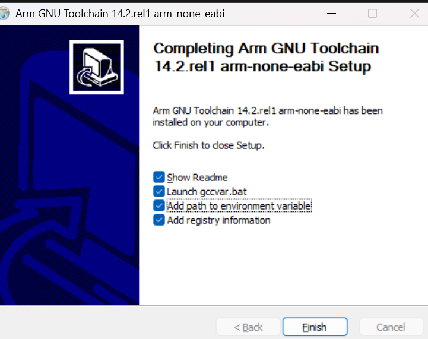

# embassy-imxrt-perf-examples with SystemView performance tracing

## Introduction

These examples illustrates how to use the embassy-imxrt HAL with performance tracing in SystemView

## Toolchain Setup

Before building the project, you need to install the required toolchains and configure your environment.

### Prequisites

1. Install LLVM toolchain
- Download and install LLVM toolchain from https://github.com/llvm/llvm-project/releases. For Windows, you can download the installer such as LLVM-20.1.5-win64.exe and follow the default installation path.
- Check the option to "Add LLVM to the system PATH"

2. Install ARM GNU Toolchain
- Download and install the ARM GNU toolchain from https://developer.arm.com/downloads/-/arm-gnu-toolchain-downloads
- Select the version which has "arm-none-eabi" for your host architecture. Example for 64-bit Windows: arm-gnu-toolchain-14.2.rel1-mingw-w64-x86_64-arm-none-eabi.exe
- On this screen, make sure to check the box that says "Add path to environment variable"


3. Configure Environment Variables
- If you didn't select "Add path to environment variable" for the LLVM toolchain and ARM GNU Toolchain with the installation wizard, you'll have to do it manually
- Type "Edit the system environment variables" in Windows search and add these two paths to your Path variable:

LLVM
```
C:\Program Files\LLVM\bin
```

ARM GNU Toolchain
```
C:\Program Files (x86)\Arm GNU Toolchain arm-none-eabi\14.2 rel1\bin
```

## Adding Examples
Add uniquely named example to `src/bin` like `adc.rs`

## Build
`cd` to examples folder
`cargo build --bin <example_name> --features systemview-tracing` for example, `cargo build --bin adc --features systemview-tracing`

## Enable tracing
To add tracing to a project, you must enable the `rtos-trace` feature that comes with `embassy-executor`.

Add these lines to your Cargo.toml, this will add systemview-tracing and enabled the `rtos-trace` feature in the embassy-executor crate.

```
systemview-tracing = { git = "https://github.com/OpenDevicePartnership/systemview-tracing" }

[features]
systemview-tracing = [
    "systemview-tracing/tracing-enabled",
    "embassy-executor/rtos-trace",
    "embassy-imxrt/systemview-tracing",
]
```

## Run
Assuming RT685 is powered and connected to Jlink debug probe and the latest probe-rs is installed via  
  `$ cargo install probe-rs-tools --git https://github.com/probe-rs/probe-rs --locked`  
`cd` to examples folder  
`cargo run --bin <example_name> --features systemview-tracing` for example, `cargo run --bin adc --features systemview-tracing`

## Performance Tool Tracing

### Download SystemView

### Flash program
```
PS C:\Users\katperez\embassy-imxrt\examples\rt685s-evk-performance-tracing> cargo run --bin gpio-blinky                                           
   Compiling embassy-imxrt-perf-examples v0.1.0 (C:\Users\katperez\embassy-imxrt\examples\rt685s-evk-performance-tracing)
    Finished `dev` profile [unoptimized + debuginfo] target(s) in 1.84s
     Running `probe-rs run --chip MIMXRT685SFVKB target\thumbv8m.main-none-eabihf\debug\gpio-blinky`
 WARN probe_rs::probe::arm_debug_interface: DAP FAULT
 WARN probe_rs::probe::arm_debug_interface: Writing DAP register failed. Ctrl/Stat register value is: Ctrl {                                      
    .0: 4026535715,
    csyspwrupack: true,
    csyspwrupreq: true,
    cdbgpwrupack: true,
    cdbgpwrupreq: true,
    cdbgrstack: false,
    c_dbg_rst_req: false,
    errmode: false,
    trn_cnt: 0,
    mask_lane: 15,
    w_data_err: false,
    read_ok: false,
    sticky_err: true,
    stick_cmp: false,
    trn_mode: 0,
    sticky_orun: true,
    orun_detect: true,
}
 WARN probe_rs::architecture::arm::ap: Failed to write AP register DRW: An error occurred in the communication with an access port or debug port. 
      Erasing ✔ 100% [####################]  80.00 KiB @  49.43 KiB/s (took 2s)
  Programming ✔ 100% [####################]  76.25 KiB @   5.65 KiB/s (took 13s)                                                                       Finished in 15.16s
 WARN probe_rs::probe::arm_debug_interface: DAP FAULT
 WARN probe_rs::probe::arm_debug_interface: Writing DAP register failed. Ctrl/Stat register value is: Ctrl {
    .0: 4026535715,
    csyspwrupack: true,
    csyspwrupreq: true,
    cdbgpwrupack: true,
    cdbgpwrupreq: true,
    cdbgrstack: false,
    c_dbg_rst_req: false,
    errmode: false,
    trn_cnt: 0,
    mask_lane: 15,
    w_data_err: false,
    read_ok: false,
    sticky_err: true,
    stick_cmp: false,
    trn_mode: 0,
    sticky_orun: true,
    orun_detect: true,
}
 WARN probe_rs::architecture::arm::ap: Failed to write AP register DRW: An error occurred in the communication with an access port or debug port. 
 WARN probe_rs::rtt: Buffer for up channel 2 not initialized
 WARN probe_rs::rtt: Buffer for down channel 2 not initialized
```

Exit the program (Ctrl+C) and open SystemView.

### Record performance data with SystemView

#### J-Link Configuration

1. Go to Target -> Recorder Configuration

Your setup will vary depending on device but the sample config below demonstrates a configuration for MIMXRT685S_M33.

J-Link Connection: USB
Target Connection: MIMXRT685S_M33
Target Interface: SWD
Interface Speed [kHZ]: 4000
Number of cores: 0
RTT Control Block Detection: Auto (note if this doesn't work please see Troubleshooting section)


### Troubleshooting


#### SystemView Errors

Enable J-Link debug logging to print out more information from the J-Link connection. To do this, go to Target -> Recorder Configuration and then click the checkbox marked "Use Advanced Settings" and add a file path to write out to in the "J-Link Log File". After click record and stop, you will be able to see a more verbose log from the J-Link connection to help you debug.

##### "Error starting recorder. Check recorder settings and make sure SystemView is enabled on the target"

It is possible that the automatic RTT Control Block Detection fails.

Example output log:
```
16:01:36 - License Manager: No license servers discovered.
16:01:38 - JLink: Device "MIMXRT685S_M33" selected.
16:01:38 - JLink: InitTarget() start
16:01:38 - JLink: InitTarget() end - Took 1.52ms
16:01:38 - JLink: Found SW-DP with ID 0x6BA02477
16:01:38 - JLink: DPIDR: 0x6BA02477
16:01:38 - JLink: CoreSight SoC-400 or earlier
16:01:38 - JLink: Scanning AP map to find all available APs
16:01:38 - JLink: AP[1]: Stopped AP scan as end of AP map has been reached
16:01:38 - JLink: AP[0]: AHB-AP (IDR: 0x84770001, ADDR: 0x00000000)
16:01:38 - JLink: Iterating through AP map to find AHB-AP to use
16:01:38 - JLink: AP[0]: Core found
16:01:38 - JLink: AP[0]: AHB-AP ROM base: 0xE00FE000
16:01:38 - JLink: CPUID register: 0x410FD213. Implementer code: 0x41 (ARM)
16:01:38 - JLink: Feature set: Mainline
16:01:38 - JLink: Cache: No cache
16:01:38 - JLink: Found Cortex-M33 r0p3, Little endian.
16:01:38 - JLink: FPUnit: 8 code (BP) slots and 0 literal slots
16:01:38 - JLink: Security extension: implemented
16:01:38 - JLink: Secure debug: enabled
16:01:38 - JLink: CoreSight components:
16:01:38 - JLink: ROMTbl[0] @ E00FE000
16:01:38 - JLink: [0][0]: E00FF000 CID B105100D PID 000BB4C9 ROM Table
16:01:38 - JLink: ROMTbl[1] @ E00FF000
16:01:38 - JLink: [1][0]: E000E000 CID B105900D PID 000BBD21 DEVARCH 47702A04 DEVTYPE 00 Cortex-M33
16:01:38 - JLink: [1][1]: E0001000 CID B105900D PID 000BBD21 DEVARCH 47701A02 DEVTYPE 00 DWT
16:01:38 - JLink: [1][2]: E0002000 CID B105900D PID 000BBD21 DEVARCH 47701A03 DEVTYPE 00 FPB
16:01:38 - JLink: [1][3]: E0000000 CID B105900D PID 000BBD21 DEVARCH 47701A01 DEVTYPE 43 ITM
16:01:38 - JLink: [1][5]: E0041000 CID B105900D PID 002BBD21 DEVARCH 47724A13 DEVTYPE 13 ETM
16:01:38 - JLink: [1][6]: E0042000 CID B105900D PID 000BBD21 DEVARCH 47701A14 DEVTYPE 14 CSS600-CTI
16:01:38 - JLink: [0][1]: E0040000 CID B105900D PID 000BBD21 DEVARCH 00000000 DEVTYPE 11 TPIU
16:01:58 - ERROR: Error starting recorder.

Check recorder settings and make sure SystemView is enabled on the target.
```

From J-Link Log:
```
T5CB0 55756:902.400 JLINK_RTTERMINAL_Control(Cmd = JLINKARM_RTTERMINAL_CMD_START)
T5CB0 55756:902.400 - 0.016ms returns 0x00
T6944 55756:902.400   CPU_ReadMem(4 bytes @ 0xE000ED00)
T6944 55756:902.400   CPU_ReadMem(4 bytes @ 0xE000EE08)
T6944 55756:902.400   CPU_ReadMem(4 bytes @ 0xE002ED08)
T6944 55756:906.496   CPU_ReadMem(4 bytes @ 0x00000020)
T6944 55756:906.496   CPU_ReadMem(24 bytes @ 0x9EED46F5)
T6944 55756:906.496   Periodic RTT: Memory read error when reading RTT CB @ 0x9EED46F5
T5CB0 55756:914.688 JLINK_IsHalted()
T5CB0 55756:914.688 - 0.338ms returns FALSE
T5CB0 55756:914.688 JLINK_RTTERMINAL_Control(Cmd = JLINKARM_RTTERMINAL_CMD_GETNUMBUF)
T5CB0 55756:914.688 - 0.014ms returns 0xFFFFFFFE
T6944 55756:914.688   CPU_ReadMem(4 bytes @ 0xE000ED00)
T6944 55756:914.688   CPU_ReadMem(4 bytes @ 0xE000EE08)
T6944 55756:922.880   CPU_ReadMem(4 bytes @ 0xE002ED08)
T6944 55756:922.880   CPU_ReadMem(4 bytes @ 0x00000020)
T6944 55756:922.880   CPU_ReadMem(24 bytes @ 0x9EED46F5)
T6944 55756:922.880   Periodic RTT: Memory read error when reading RTT CB @ 0x9EED46F5
T5CB0 55756:922.880 JLINK_RTTERMINAL_Control(Cmd = JLINKARM_RTTERMINAL_CMD_GETNUMBUF)
T5CB0 55756:922.880 - 0.086ms returns 0xFFFFFFFE
T5CB0 55756:926.976 JLINK_RTTERMINAL_Control(Cmd = JLINKARM_RTTERMINAL_CMD_GETNUMBUF)
T5CB0 55756:926.976 - 0.066ms returns 0xFFFFFFFE
T6944 55756:926.976   CPU_ReadMem(4 bytes @ 0xE000ED00)
T6944 55756:926.976   CPU_ReadMem(4 bytes @ 0xE000EE08)
T6944 55756:926.976   CPU_ReadMem(4 bytes @ 0xE002ED08)
T6944 55756:926.976   CPU_ReadMem(4 bytes @ 0x00000020)
T6944 55756:926.976   CPU_ReadMem(24 bytes @ 0x9EED46F5)
T6944 55756:926.976   Periodic RTT: Memory read error when reading RTT CB @ 0x9EED46F5
T5CB0 55756:935.168 JLINK_RTTERMINAL_Control(Cmd = JLINKARM_RTTERMINAL_CMD_GETNUMBUF)
T5CB0 55756:935.168 - 0.015ms returns 0xFFFFFFFE
T5CB0 55756:939.264 JLINK_RTTERMINAL_Control(Cmd = JLINKARM_RTTERMINAL_CMD_GETNUMBUF)
T5CB0 55756:939.264 - 0.036ms returns 0xFFFFFFFE
T6944 55756:939.264   CPU_ReadMem(4 bytes @ 0xE000ED00)
T6944 55756:939.264   CPU_ReadMem(4 bytes @ 0xE000EE08)
T6944 55756:939.264   CPU_ReadMem(4 bytes @ 0xE002ED08)
T6944 55756:939.264   CPU_ReadMem(4 bytes @ 0x00000020)
T6944 55756:939.264   CPU_ReadMem(24 bytes @ 0x9EED46F5)
```

This shows that the RTT Terminal is having trouble finding the _SEGGER_RTT control block address. To find it manually, run the following (substitute gpio-blinky for your output file):

```
$ arm-none-eabi-objdump -t gpio-blinky | grep SEGGER_RTT
00000000 l    df *ABS*  00000000 SEGGER_RTT.c
0800381c g     F .text  00000128 SEGGER_RTT_TerminalOut
08003570 g     F .text  0000010c SEGGER_RTT_ReadNoLock
08003944 g     F .text  00000000 SEGGER_RTT_ASM_WriteSkipNoLock
2008099c g     O .bss   000000a8 _SEGGER_RTT
0800367c g     F .text  00000108 SEGGER_RTT_AllocUpBuffer
08003784 g     F .text  00000098 SEGGER_RTT_ConfigDownBuffer
```

Paste the address found in the left-most column, in this example it is "2008099c", into the SystemView Recorder Configuration Settings under RTT Control Block Detection -> Address